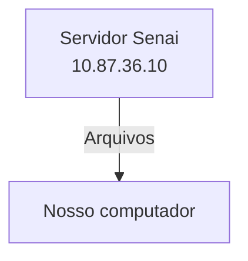
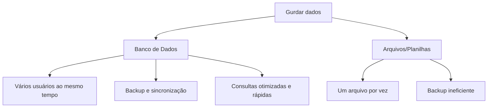

## Anotações
Simular um ambiente real de produção

- Algo do mercado
- Administração de recursos
- Experiencia em servidores Linux 
## Servidor de arquvios 
Servidor educacional para arquvios, assim não dependendo da red externa 


## Servidor de desenvolvimento
---
- Cada aluno recebe o seu propio acesso.
- Cada máquina possui um endereço de IP diferente.
- 192.168.10.34
--- 
|Recurso|configuração|
|-------|------------|
|CPU|2 Cores|
|RAM|512Mb|
|Disco|6Gb|
|SOP| Ubuntu 26.04 LTS|
|Acesso|SSH (Secure Shell)
---
## Dados de acesso:

|Campo|valor|
|-----|------|
|IP Container| 192.168.10.34|
|Usuario|root|
|senha inicial|aluno01|
---
### Comando para visualizar uso de recursos:
```bash
htop    
```
### Comando para trocar a senha:
```bash
passwd
```
<br> 

## Banco de Dados
<B>Dados:</b> Tinformações isolados que não dizem muita coisa. EX: Platini, futebol, Chuteira.
<b>Informação:</b> Dados estruturados. EX: O platini comprou uma chuteira para jogar futebol.
- <b>Conhecimento:</b> O que podemos extrair à partir das informações. EX: O platini vai jogar futebol com a I1D35.


---
#### O fluxo normal de um banco de dados, está representado à seguir: 

---
<br>

> Por qual razão, as empresas não salvam os dados em arquivos comuns?

---

## SGBD
Sistema Gerenciador de Banco de Dados.
> POSTGRESQL: SGBD OpenSource  muito completo.
---
#### Primeiro começamos att os pacotes 
```bash
sudo apt upgrade && update -y
```
#### Para instalar o Postgresql:
```bash
sudo apt install -y postgresql
```

