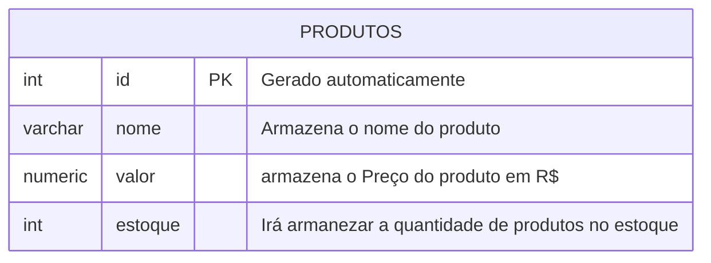
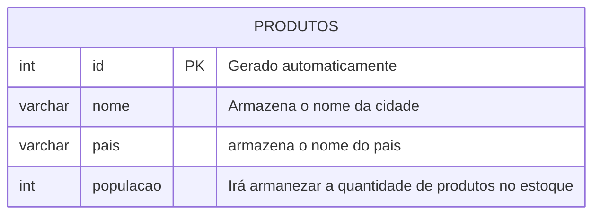
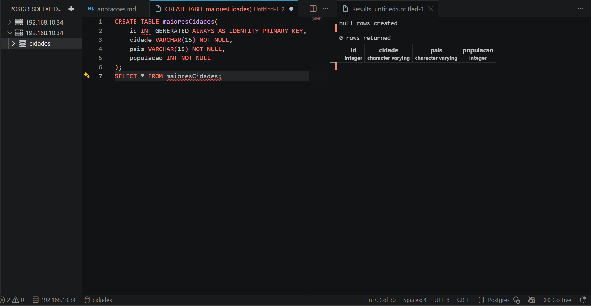
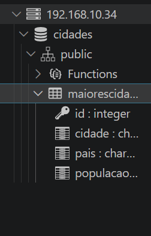
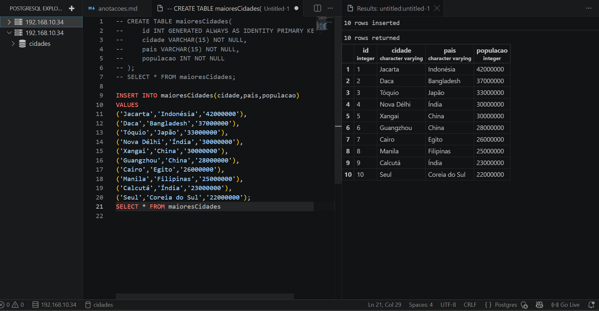

## Aula 03 
Parar apagar um banco de dados, utilizamos o comando:

```sql 
DROP DATABASE cidades;
```

>Não esquecer do ;

---

**modelagem do banco de dados**


Após modelar, iremos executar as etapas de criação e inserção de dados.
---
Para criar a primeira tabela, usamos os comandos: 
```sql 
CREATE TABLE produtos(
    id INT GENERATED ALWAYS AS IDENTITY PRIMARY KEY,
    nome VARCHAR(100) NOT NULL, 
    valor NUMERIC(10,2) NOT NULL,
    estoque INT NOT NULL DEFAULT 0
);

```
Para consultar todos os elementos da tabela, uso o comando: 
```sql
SELECT FROM * produtos;
```
Para inserir uma linha ao banco de dados: 
```sql 
INSERT INTO produtos(nome,valor,estoque)
VALUES('Caneta','27.90','100');
```
> Lembrar de comentar o codigo, ou apagar, para não executar denovo
---

# Atividade prática:

## Criação da tabela/colunas: 

--- 



> Como o maior pais/cidade teria 13 caracteres (coreia do sul), VARCHAR --> (15) <--

### Estrutura: 



## Inserindo elementos na tabela:



## Comandos utilizados:
```sql
 CREATE TABLE maioresCidades(
    id INT GENERATED ALWAYS AS IDENTITY PRIMARY KEY,
    cidade VARCHAR(15) NOT NULL,
    pais VARCHAR(15) NOT NULL,
    populacao INT NOT NULL
 );
SELECT * FROM maioresCidades;

INSERT INTO maioresCidades(cidade,pais,populacao)
VALUES
('Jacarta','Indonésia','42000000'),
('Daca','Bangladesh','37000000'),
('Tóquio','Japão','33000000'),
('Nova Délhi','Índia','30000000'),
('Xangai','China','30000000'),
('Guangzhou','China','28000000'),
('Cairo','Egito','26000000'),
('Manila','Filipinas','25000000'),
('Calcutá','Índia','23000000'),
('Seul','Coreia do Sul','22000000');
SELECT * FROM maioresCidades

```
