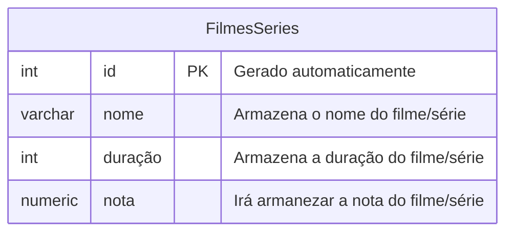
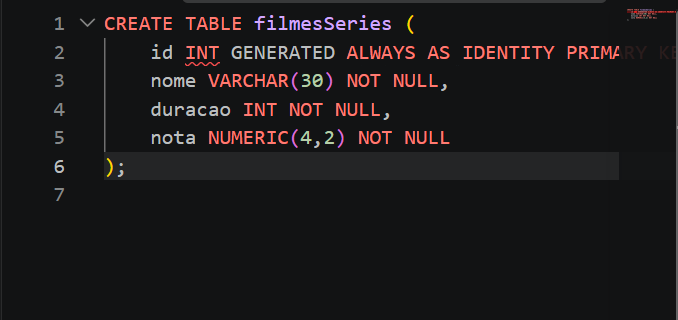
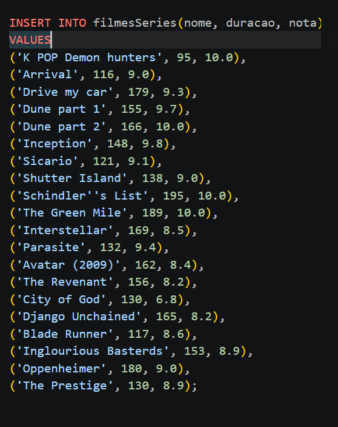
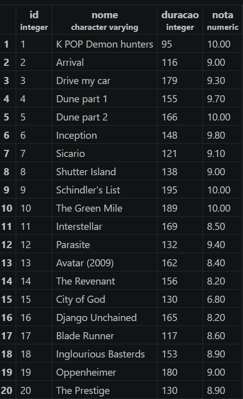
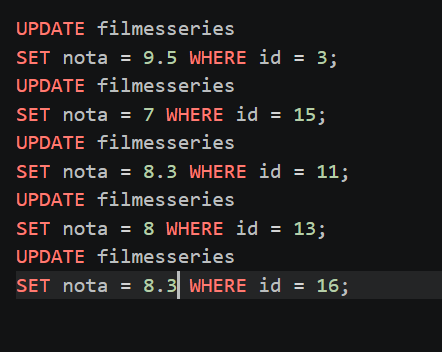
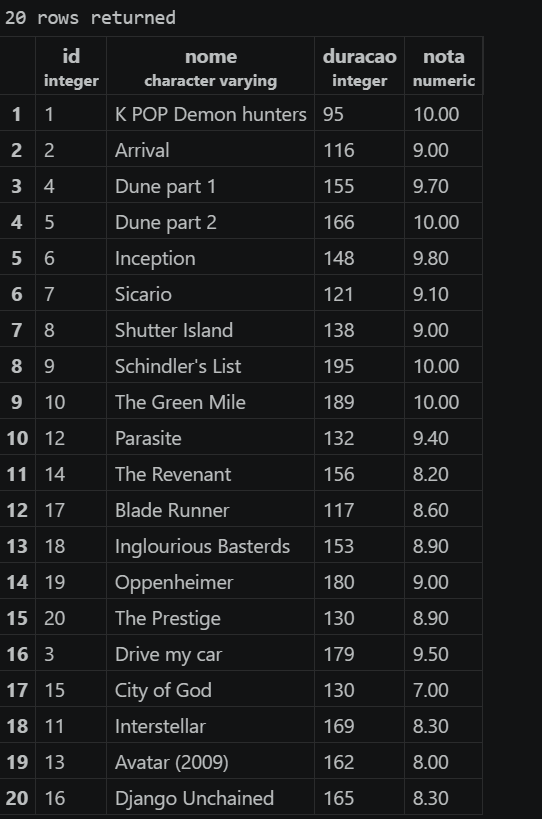
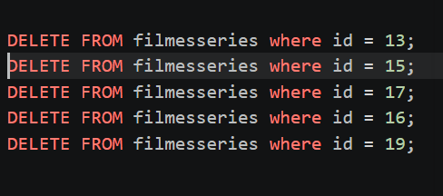
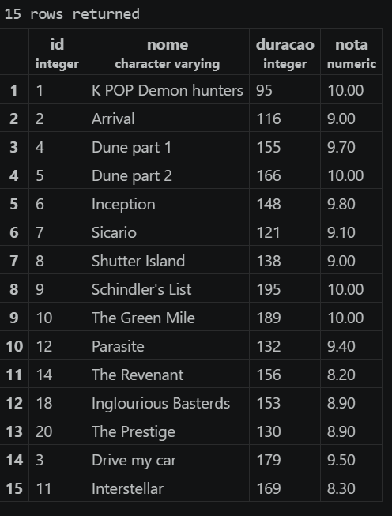

# Update e delete 

## Modelando banco de dados


## Criando a tabela : 

<hr>

### Adicionando as informações : 


### Confirmação da tabela: 


<hr>

## Atualizando 5 notas: 


### Confirmação da tabela:

<hr>

## Deletando 5 registros: 


### Confirmação da tabela: 


## Todos os comandos executados: 
```sql 
CREATE TABLE filmesSeries (
      id INT GENERATED ALWAYS AS IDENTITY PRIMARY KEY,
      nome VARCHAR(30) NOT NULL,
      duracao INT NOT NULL,
      nota NUMERIC(4,2) NOT NULL
 );

 SELECT * FROM filmesSeries;

 INSERT INTO filmesSeries(nome, duracao, nota)
 VALUES
 ('K POP Demon hunters', 95, 10.0),
 ('Arrival', 116, 9.0),
 ('Drive my car', 179, 9.3),
 ('Dune part 1', 155, 9.7),
 ('Dune part 2', 166, 10.0),
 ('Inception', 148, 9.8),
 ('Sicario', 121, 9.1),
 ('Shutter Island', 138, 9.0),
 ('Schindler''s List', 195, 10.0),
 ('The Green Mile', 189, 10.0),
 ('Interstellar', 169, 8.5),
 ('Parasite', 132, 9.4),
 ('Avatar (2009)', 162, 8.4),
 ('The Revenant', 156, 8.2),
 ('City of God', 130, 6.8),
 ('Django Unchained', 165, 8.2),
 ('Blade Runner', 117, 8.6),
 ('Inglourious Basterds', 153, 8.9),
 ('Oppenheimer', 180, 9.0),
 ('The Prestige', 130, 8.9);

 UPDATE filmesseries 
 SET nota = 9.5 WHERE id = 3;
 UPDATE filmesseries 
 SET nota = 7 WHERE id = 15;
 UPDATE filmesseries 
 SET nota = 8.3 WHERE id = 11;
 UPDATE filmesseries
 SET nota = 8 WHERE id = 13;
 UPDATE filmesseries
 SET nota = 8.3 WHERE id = 16;

 DELETE FROM filmesseries where id = 13;
 DELETE FROM filmesseries where id = 15;
 DELETE FROM filmesseries where id = 17;
 DELETE FROM filmesseries where id = 16;
 DELETE FROM filmesseries where id = 19;
 
SELECT * FROM filmesseries;


```