# Aula 05

## Parte 1 -- Criação e inserção de dados

### Criando tabela "produtos" 
```sql 
 CREATE TABLE produtos(
    id SERIAL PRIMARY KEY,
    nome varchar(60) NOT NULL,
    valor DECIMAL(10,2) NOT NULL,
    categoria VARCHAR(30) NOT NULL,
    estoque INTEGER NOT NULL 
);

```

### Acicionando itens a tabela 
```sql

INSERT INTO produtos (nome, categoria, valor, estoque) VALUES
('Mouse Óptico USB', 'Periféricos', 50.00, 120),
('Mouse Sem Fio', 'Periféricos', 89.90, 85),
('Mouse Gamer RGB', 'Periféricos', 249.00, 32),
('Teclado ABNT2 USB', 'Periféricos', 120.00, 64),
('Teclado Mecânico Gamer', 'Periféricos', 459.00, 18),
('Teclado Sem Fio Slim', 'Periféricos', 199.00, 40),
('Mousepad Grande', 'Periféricos', 45.00, 150),
('Suporte Ergonômico Notebook', 'Periféricos', 135.00, 28),
('Hub USB 4 Portas', 'Periféricos', 79.00, 95),
('Adaptador USB-C HDMI', 'Periféricos', 159.00, 47),

('Monitor 21,5 Full HD', 'Monitores', 750.00, 22),
('Monitor 24 Full HD IPS', 'Monitores', 950.00, 19),
('Monitor 27 QHD', 'Monitores', 1890.00, 8),
('Monitor 32 4K', 'Monitores', 2790.00, 4),
('Monitor Gamer 144Hz', 'Monitores', 1650.00, 11),
('Suporte Articulado Monitor', 'Monitores', 289.00, 26),

('Notebook Básico 8GB', 'Notebooks', 2890.00, 14),
('Notebook Intermediário 16GB', 'Notebooks', 4500.00, 9),
('Notebook Gamer RTX', 'Notebooks', 7990.00, 3),
('Notebook Ultrafino 14', 'Notebooks', 5300.00, 6),
('Chromebook 11', 'Notebooks', 1790.00, 17),
('Carregador Universal 65W', 'Notebooks', 189.00, 58),

('Impressora Laser Mono', 'Impressão', 800.00, 12),
('Impressora Multifuncional', 'Impressão', 1250.00, 7),
('Impressora Tanque de Tinta', 'Impressão', 1090.00, 10),
('Toner Compatível Preto', 'Impressão', 145.00, 72),
('Cartucho Colorido', 'Impressão', 98.00, 88),
('Papel A4 500 folhas', 'Impressão', 29.90, 240),
('Scanner de Mesa', 'Impressão', 690.00, 5),

('Roteador Wi-Fi 5 Dual Band', 'Redes', 249.00, 35),
('Roteador Wi-Fi 6 AX1500', 'Redes', 459.00, 16),
('Switch 8 Portas Gigabit', 'Redes', 329.00, 21),
('Cabo de Rede Cat6 5m', 'Redes', 35.00, 180),
('Repetidor de Sinal Wi-Fi', 'Redes', 139.00, 54),
('Placa de Rede USB Wi-Fi', 'Redes', 89.00, 66),
('Nobreak 1500VA', 'Redes', 980.00, 6),

('SSD 480GB SATA', 'Armazenamento', 289.00, 45),
('SSD 1TB NVMe', 'Armazenamento', 549.00, 24),
('SSD 2TB NVMe', 'Armazenamento',1090.00, 9),
('HD Externo 1TB', 'Armazenamento', 379.00, 31),
('HD Externo 2TB', 'Armazenamento', 549.00, 15),
('Pen Drive 64GB', 'Armazenamento', 49.90, 200),
('Pen Drive 128GB', 'Armazenamento', 79.90, 110),
('Cartão de Memória 128GB', 'Armazenamento', 99.00, 76),

('Headset Gamer com Microfone', 'Áudio', 250.00, 38),
('Headset Bluetooth', 'Áudio', 329.00, 27),
('Caixa de Som Bluetooth', 'Áudio', 189.00, 49),
('Fone Intra-Auricular', 'Áudio', 69.90, 130),
('Microfone Condensador USB', 'Áudio', 449.00, 13),
('Webcam Full HD 1080p', 'Áudio', 180.00, 41);

```

---

### Em uma base de dados muito grande, é interessante filtrar registros: 

```sql 
SELECT * FROM produtos
LIMIT 5;
```

### Para filtrar colunas: 
```sql 
SELECT nome,valor,categoria FROM produtos;
```
---

### Para filtrar categorias distintas:
```sql
SELECT DISTINCT categoria FROM produtos ORDER BY categoria; 
```

## Parte 02
Filtro de dados.  

### Para filtrar produtos por categoria 
```sql
SELECT nome,estoque FROM produtos WHERE categoria = 'Redes';
```

### Para filtrar por valor 
```sql
SELECT nome,estoque FROM produtos
WHERE valor > 1000;
```

### Filtro entre faixa de valores
```sql
SELECT nome,estoque FROM produtos
WHERE valor BETWEEN 100 AND 500;
```

# Parte 3

## Atividade prática análise de dados 

## Criando tabela: 

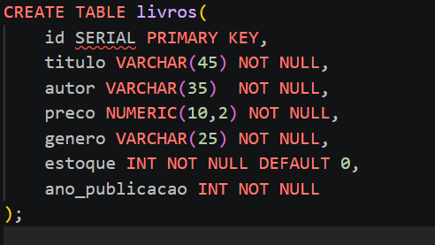

## Análise: 

### Exibindo os 10 primeiros registros da tabela: 
```sql
SELECT * FROM livros
LIMIT 10; 
```
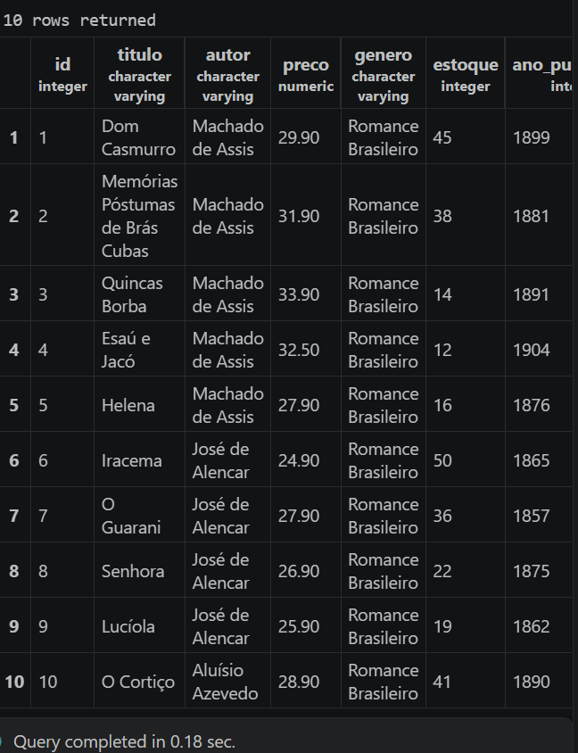

## Exibindo apenas colunas específicas (titulo, autor e preco)
```sql
SELECT nome,autor,preco FROM livros; 
```
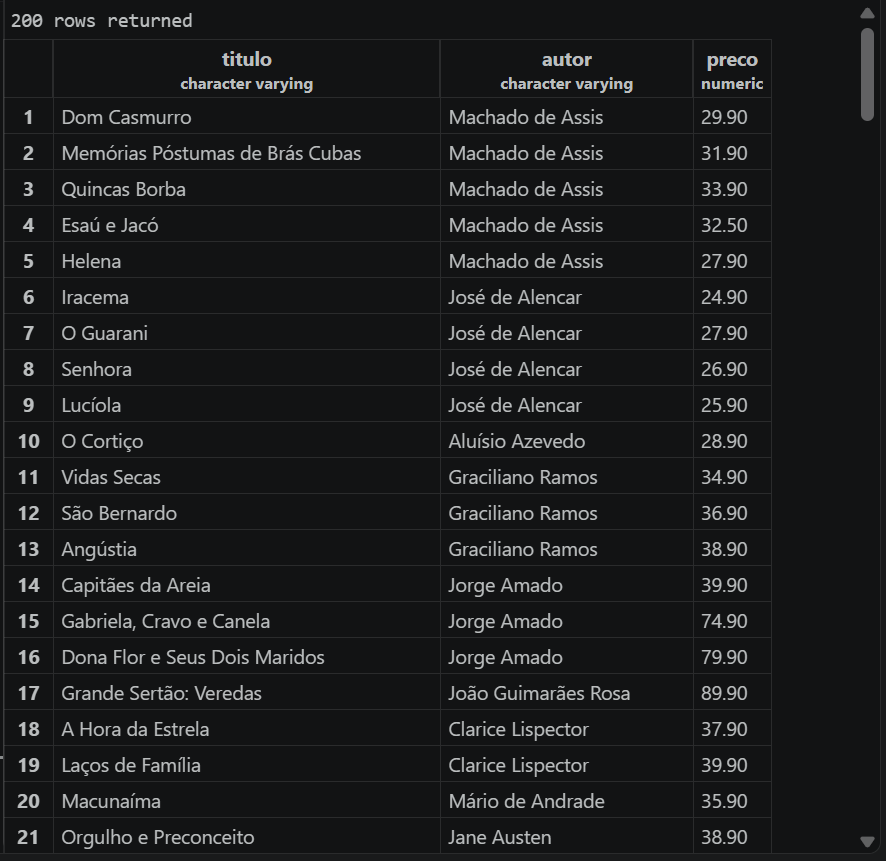

##Listando gêneros existentes em ordem alfabética
```sql
SELECT DISTINCT genero FROM livros 
ORDER BY genero;
```


## Descobrindo a quantidade de autores diferentes, para isso apenas encontrar a quantidade de linhas do resultado da busca.
```sql
SELECT DISTINCT autor FROM livros;  
```
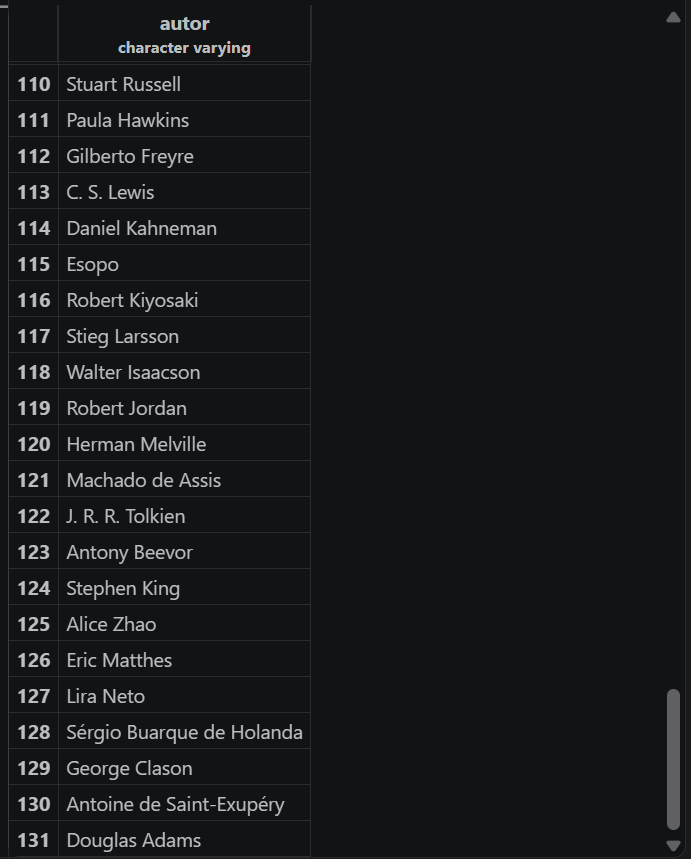

## Descobrindo os 5 livros mais caros da base
```sql 
SELECT titulo,preco FROM livros 
ORDER BY preco DESC
LIMIT 5;
```
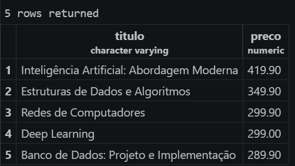

## Descobrindo os 5 livros com menor estoque 
```sql 
SELECT titulo,estoque FROM livros 
ORDER BY estoque
LIMIT 5;
```
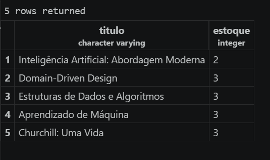

# Parte 3B

## Análise 

## Listando título e preco de todos os livros que custam mais de R$200
```sql
SELECT titulo,estoque FROM livors WHERE genero = 'Técnico';
```
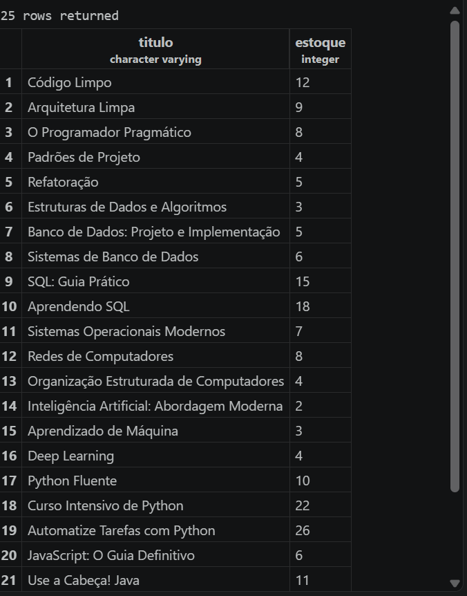

--- 

## Mostrando titulo e preco dos livros que custam mais 200 reais
```sql
SELECT titulo,preco FROM livros 
WHERE preco > 200; 
```
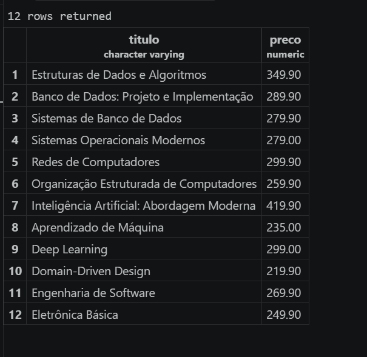

--- 

## Mostrando titulo e preco dos livros que custam entre R$ 40,00 e R$ 70,00. (res: 22 livros)
```sql 
SELECT titulo,preco FROM livros 
WHERE preco BETWEEN 40 AND 70;
```
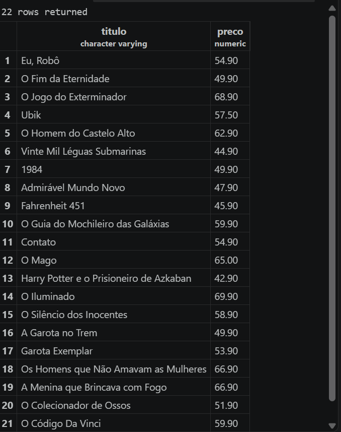

--- 

## Mostrando livros com estoque abaixo de 5 unidades, requer reposição urgente para 12 livros
```sql
SELECT * FROM livros 
WHERE estoque < 5 ;
```
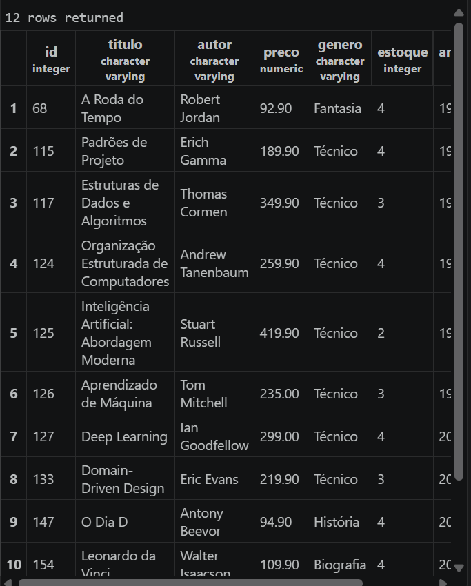

--- 

## Livros publicados antes de 1900 ordenando por mais antigo (41 livros)
```sql
SELECT * FROM livros 
WHERE ano_publicacao < 1900 
ORDER BY ano_publicacao DESC ;
```
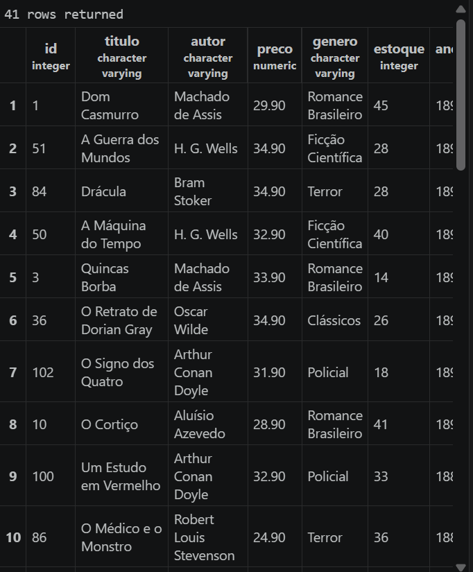

--- 

## Livros publicados entre 2010 e 2020, mostrando título, ano e gênero
```sql
SELECT titulo,ano_publicacao,genero FROM livros 
WHERE ano_publicacao BETWEEN 2010 AND 2020;
```
