# AULA 06 

## Criando tabela 

```sql 
CREATE TABLE produtos (
    id SERIAL PRIMARY KEY NOT NULL,
    nome VARCHAR(60) NOT NULL,
    categoria VARCHAR(30) NOT NULL,
    marca VARCHAR(30) NOT NULL,
    preco DECIMAL(10, 2) NOT NULL,
    estoque INT NOT NULL DEFAULT 0,
    data_cadastro DATE NOT NULL 
);
```

### Contagem de linhas
> Para ter uma dimensão do tamanho da base de dados: 
```sql
SELECT COUNT(*) FROM produtos;
```

### Alias
```sql 
SELECT COUNT(*) AS contagem_de_linhas FROM produtos;
```

### Filtragem de produtos (quantidade)
```sql 
SELECT COUNT(*) AS produtos_em_baixa FROM produtos WHERE estoque < 10;
```

## Funções

### Para checar o maior 
> Utilizasse a função " MAX "
```sql 
SELECT MAX(preco) AS valor_mais_caro FROM produtos; 
```

### Para checar o menor
> Utilizasse a função " MIX " 
```sql 
SELECT MIN(preco) AS valor_mais_caro FROM produtos; 
```

### Para checar a média 
> Utilizasse a função " AVG "
```sql 
SELECT AVG(preco) AS media_preco FROM produtos; 
```

### Para arredondar um número
> Utilizasse a função " ROUND "
```sql 
SELECT ROUND(AVG(preco), 2) AS media_preco FROM produtos; 
```

### Para somar 
> Utilizassea função " SUM "
```sql 
SELECT SUM(estoque) AS produtos_em_estoque FROM produtos; 
```

### Calculando faturamento 

#### Por produto
```sql
SELECT nome,preco,estoque, (preco * estoque) AS faturamente_por_produto FROM produtos;
```

#### Total
```sql
SELECT SUM(preco * estoque) AS faturamento_total FROM produtos;
```

# Atividade -- análise de dados

## PARTE A

### Nome e preco, produtos da categoria monitor 
```sql 
SELECT nome,preco FROM produtos WHERE categoria = 'Monitores'; 
```
> Existem 100 moedelos de monitores diferentes
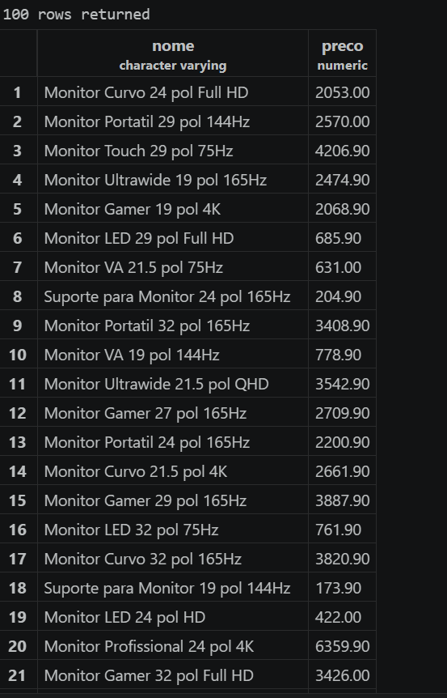

### Produtos com estoque menor que 5 unidades (nome, categoria, estoque)
```sql
SELECT nome,categoria,estoque FROM produtos WHERE estoque < 5; 
```
> 118 produtos com estoque menor que 5
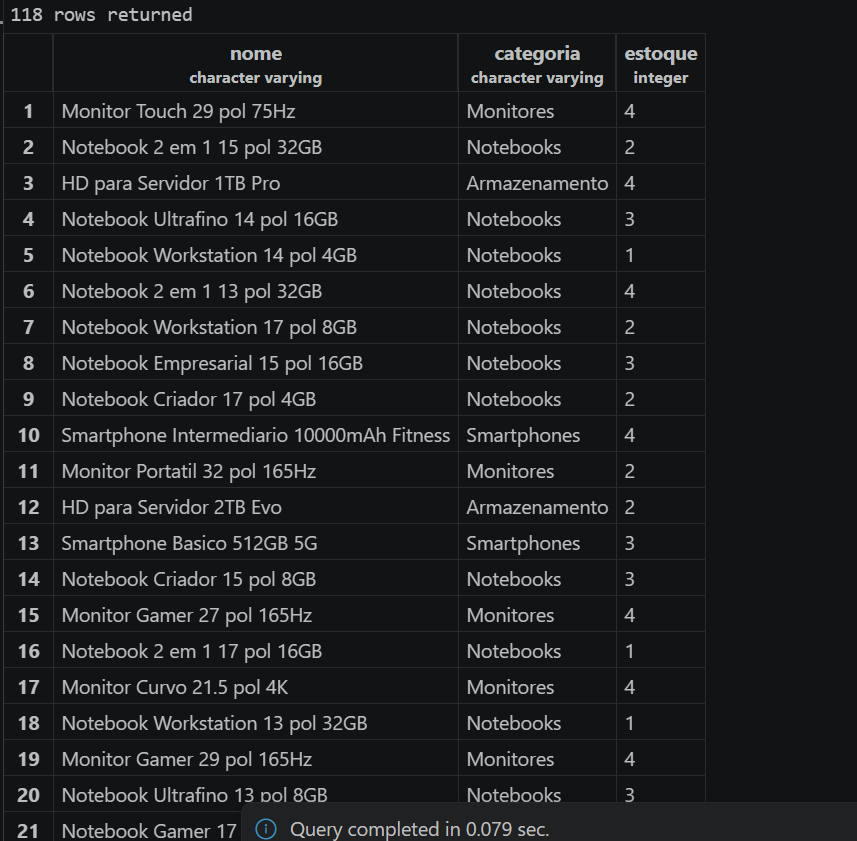

### Listando 10 produtos mais caros da loja (nome e preco), ordem decrescente
```sql
SELECT nome,preco FROM produtos ORDER BY preco DESC LIMIT 10;
```
> Produto mais caro custa 20386.90 enquanto o mais barato 13323.00
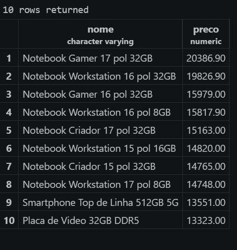

### Listando produtos da marca logitech em ordem preco crescente
```sql 
SELECT nome,preco FROM produtos WHERE marca = 'Logitech' ORDER BY preco DESC;
```
> 23 produtos da marca Logitech
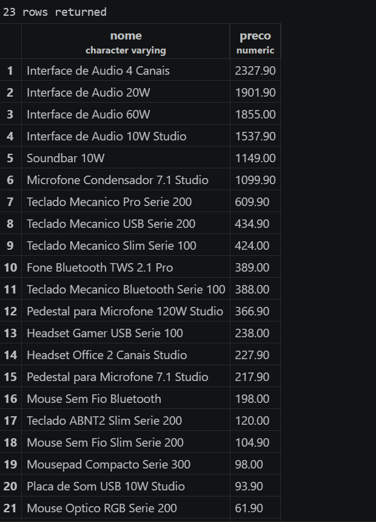

### Listando todos os produtos entre 100 e 500 reais ( nome e preco)
```sql
SELECT nome,preco FROM produtos WHERE preco >= 100 AND preco <= 500;  
```
>327 produtos nesta faixa de preco
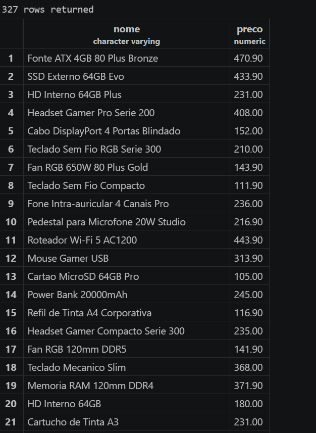

## PARTE B

### Todos os produtos cadastrados na loja 
```sql 
SELECT COUNT(*) AS total_produtos FROM produtos;  
```
> 1000 produtos cadastrados na loja 
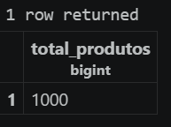

### Produtos com estoque abaixo de 10 unidades 
```sql 
SELECT COUNT(*) AS produtos_em_falta FROM produtos WHERE estoque < 10 ; 
```
>265 produtos em falta
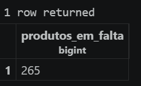

### Maior e menor preco da loja 
```sql
SELECT nome, MAX(preco) AS maior_preco,
MIN(preco) AS menor_preco
FROM produtos; 
```
> Produto mais caro 20386.90 e mais barato 22.90
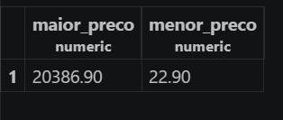

### Preço médio dos notebooks, (2 casas decimais)
```sql 
SELECT ROUND(AVG(preco), 2) AS preco_medio FROM produtos WHERE categoria = 'Notebooks';
```
> Preço médio dos notebooks 6458.38
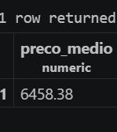

### Total de peças na loja 
```sql
SELECT SUM(estoque) AS total_pecas FROM produtos;
```
> A loja possui um total de 37891 produtos em estoque 
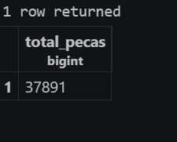

## PARTE C

### Painel resumo 
```sql
SELECT 

COUNT(*) AS quantidade_produtos,
ROUND(AVG(preco), 2) AS preco_medio,
MAX(preco) AS maior_preco,
MIN(preco) AS menor_preco, 
SUM(estoque) AS total_pecas
FROM produtos;  
```
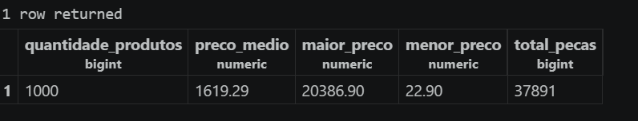

### Valor imobilizado
```sql
SELECT nome, 
preco,
estoque,
(preco * estoque) AS preco_imobilizado 
FROM produtos 
ORDER BY preco_imobilizado 
DESC
LIMIT 5; 
```
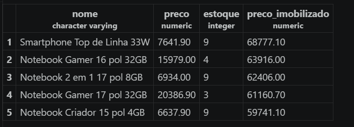

### Comparação 
> O produto com maior valor imobilizado em C2 é o " Smartphone top de linha 33W " enquanto o produto mais caro da loja é o notebook game 17 pol 32GB. Isso significa que um produto mais barato mas com estoque maior pode gerar mais lucro final. 