# Aula 07 

## Atividade prática -- análise de dados 

### BLOCO 1:

#### 1. Primeiras 20 vendas cadastradas

```sql 
SELECT * FROM vendas LIMIT 20;
```
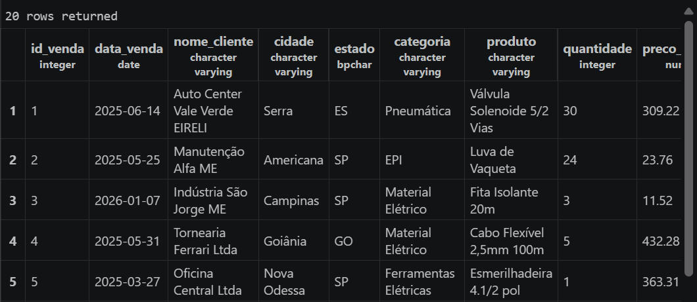

#### 2. Total de vendas registradas

```sql
SELECT COUNT(*) AS total_De_vendas FROM vendas; 
```
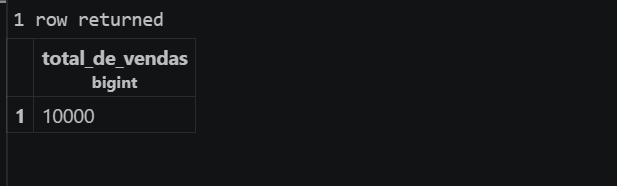

#### 3. Categorias trabalhadas ordem alfabética

```sql 
SELECT DISTINCT categoria FROM vendas ORDER BY categoria ;
```
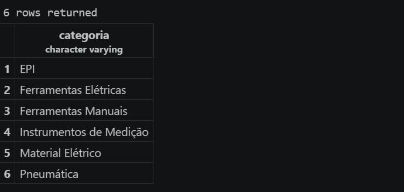

#### 4. Cidades/Estados que possuem clientes

```sql
SELECT DISTINCT cidade,estado FROM vendas; 
```
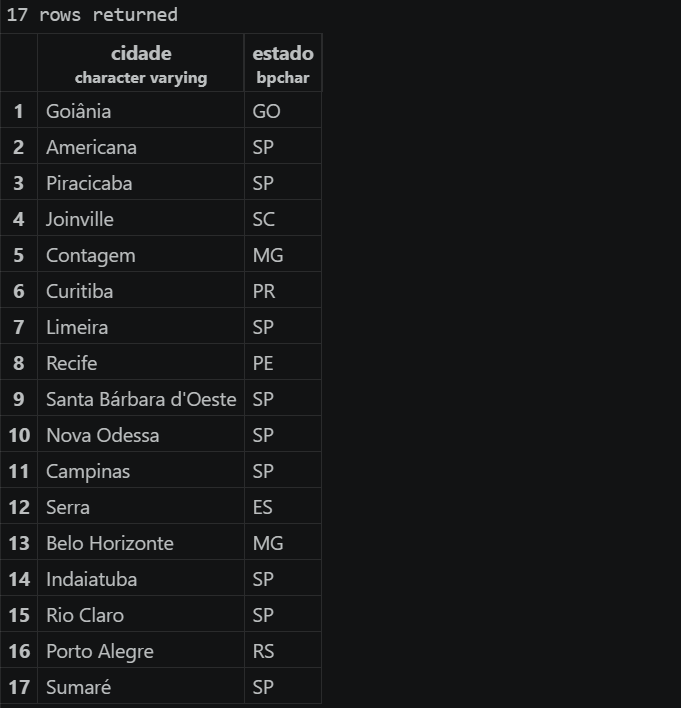

### Bloco 2: 

#### 5. Listando id, produto, quantidade e preço unitário ( EPI )

```sql 
SELECT id_venda, produto, quantidade, preco FROM vendas WHERE categoria = 'EPI'; 
```
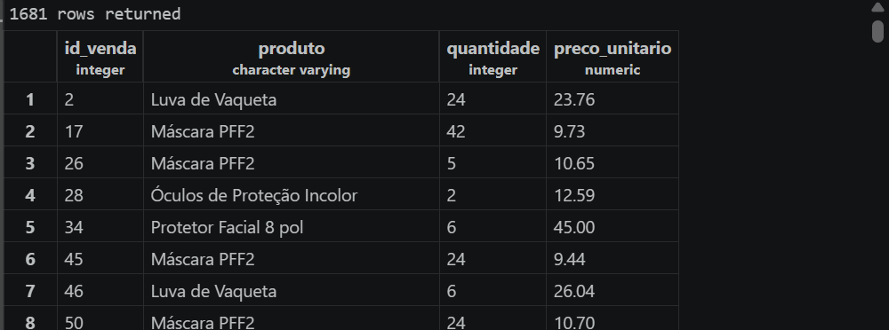

#### 6. Listando produtos, vendas maior que 40 unidade e preco maior que 300 

```sql 
SELECT * FROM vendas WHERE quantidade > 40 AND preco_unitario > 300 ; 
```
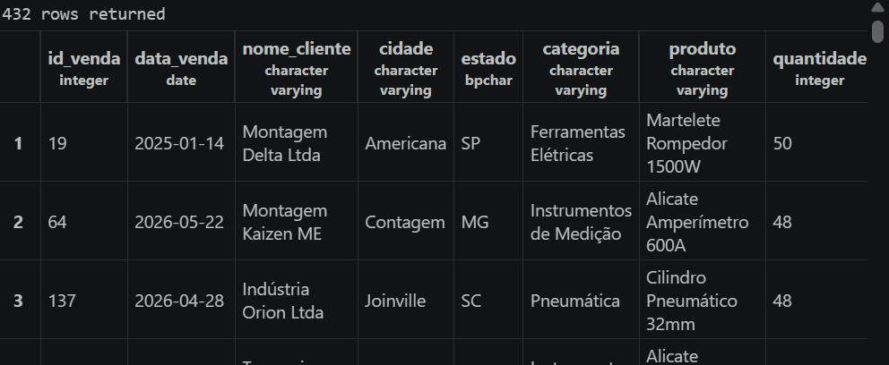

#### 7. Listando id, cidade, produto das vendas para clientes de americana, campinas, piracicaba 

```sql
SELECT id_venda, nome_cliente, cidade, produto FROM vendas WHERE cidade IN ('Americana', 'Campinas', 'Piracicaba');
```
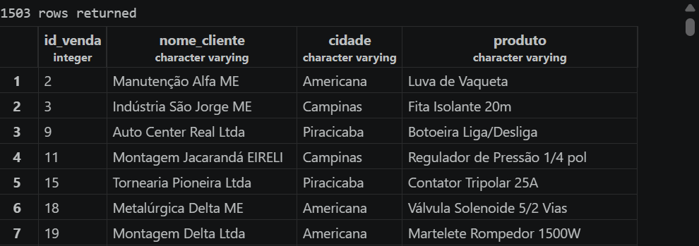

#### 8. Listando id, data, cliente e produto de vendas feitas depois de março/2026
```sql
SELECT id_venda, data_venda, nome_cliente FROM vendas WHERE data_venda = ' %-03-2026 '; 
```
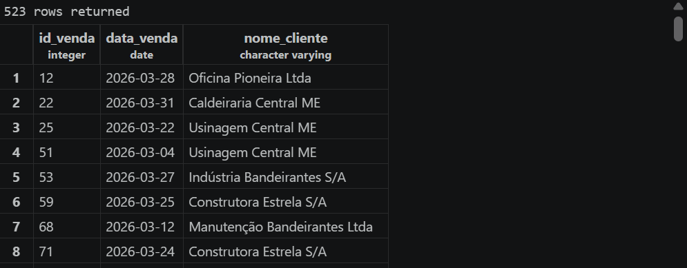

#### 9. Listando vendas cujo nome do cliente começa com "Metalúrgica"
```sql
SELECT * FROM vendasWHERE nome_cliente ILIKE 'metalúrgica%';
```
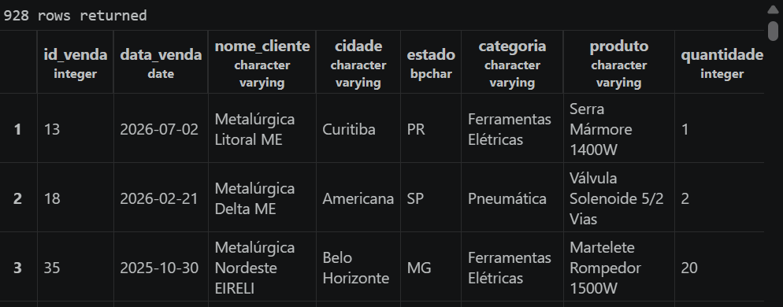

#### 10. Listando vendas com estado 'Cancelado' 

```sql 
SELECT * FROM vendas WHERE status_entrega = 'Cancelado' 
AND (forma_pagamento = 'Boleto' OR forma_pagamento = 'PIX');
```
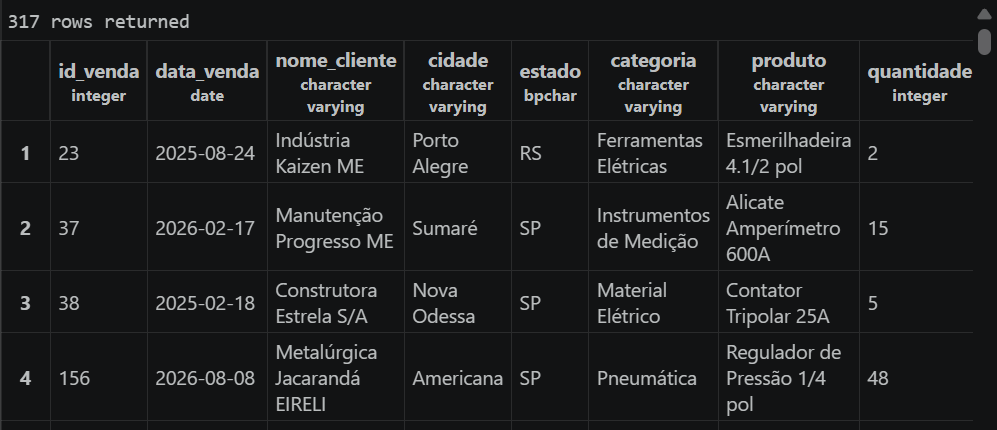

### Bloco 3. 

#### 11. Listando id, produto e preco dos 10 produtos mais caros 

```sql
SELECT id_venda, produto, preco_unitario FROM vendas ORDER BY preco_unitario DESC LIMIT 10; 
```
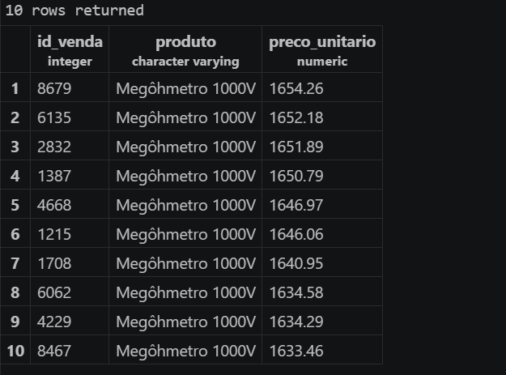

#### 12. 5 vendas mais antigas (instrumentos de medição)

```sql
SELECT id_venda, data_venda, produto ,nome_cliente FROM vendas WHERE categoria = 'Instrumentos de Medição' ORDER BY data_venda LIMIT 5; 
```
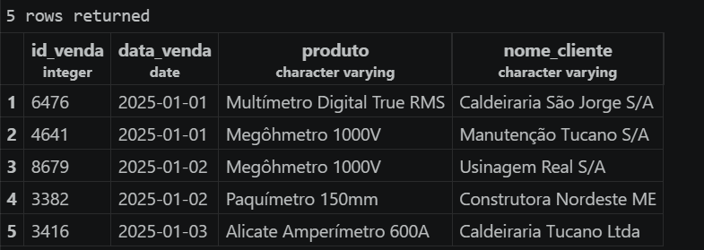

#### 13. Vendedora Ana Ribeiro 

```sql 
SELECT * FROM vendas WHERE vendedor = 'Ana Ribeiro' ORDER BY data_venda DESC, quantidade DESC LIMIT 20; 
```
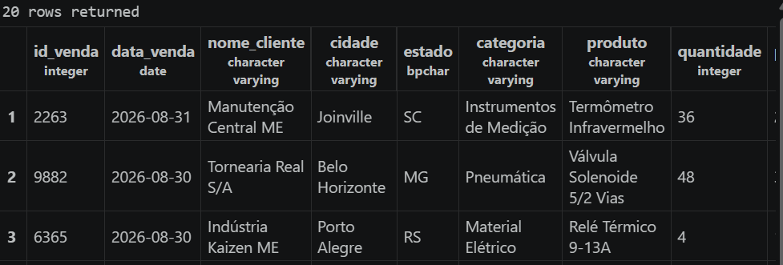

### Bloco 4.

#### 14. Calculo do valor das vendas
```sql
SELECT id_venda, produto, quantidade, preco_unitario, quantidade * preco_unitario AS valor_bruto FROM vendas WHERE categoria = 'Ferramentas Elétricas' ORDER BY valor_bruto DESC LIMIT 10;
```
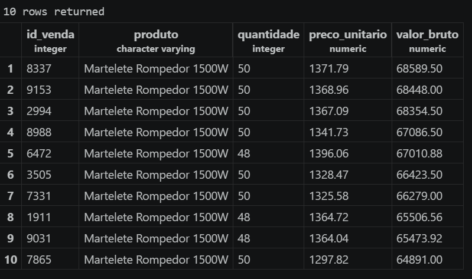

#### 15. Calculo de valor liquido 

```sql
SELECT id_venda, produto, quantidade, preco_unitario,ROUND((quantidade * preco_unitario) - (quantidade * preco_unitario * desconto_percentual / 100),4) AS valor_liquido FROM vendas WHERE desconto_percentual > 0 ORDER BY valor_liquido DESC LIMIT 10 ; 
```
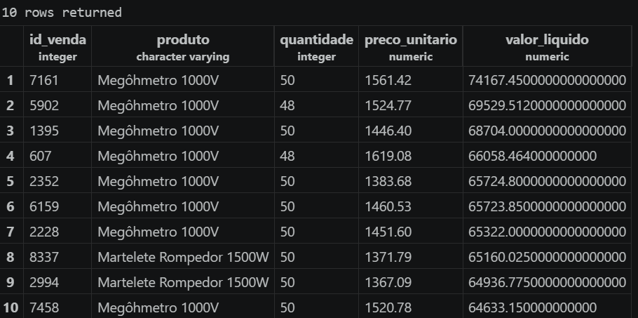

### Bloco 5:

#### 16. Faturamento bruto e apenas categoria EPI
A)
```sql
SELECT SUM(quantidade * preco_unitario) AS faturamento_bruto FROM vendas;
```
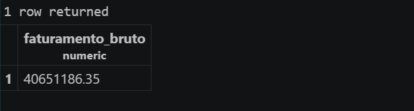
B)
```sql
SELECT SUM(quantidade * preco_unitario) AS faturamento_bruto_EPI FROM vendas WHERE categoria = 'EPI';
```


#### 17. Pesquisa Estado de SP 
```sql
SELECT round(AVG(quantidade * preco_unitario),4) AS ticket_médio, 
MAX(quantidade * preco_unitario) AS maior_venda,
MIN(quantidade * preco_unitario) AS menor_venda,
COUNT(*) AS quantidade_De_vendas FROM vendas
WHERE estado = 'SP' ;
```
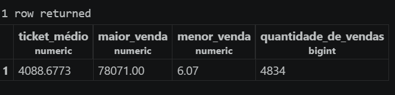

### Bloco 5.

#### 18. Cadastrando venda 

```sql 
INSERT INTO vendas (id_venda, data_venda, nome_cliente, cidade, estado, categoria, produto, quantidade, preco_unitario, desconto_percentual, forma_pagamento, vendedor, status_entrega) 
VALUES (
    10001, '2026-09-15', 'TECH CLAUDIO', 'Piracaia', 'SP', 'Ferramentas Elétricas', 'Furadeira', 999, 1500.00, 5, 'PIX', 'Claudio', 'Em Transporte'
)
SELECT * FROM vendas WHERE id_venda = 10001; 
```
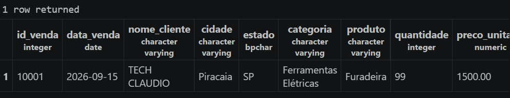

#### 19. Alterando status de compra
```sql
UPDATE vendas
SET status_entrega = 'Cancelado'
WHERE id_venda = 10001;
SELECT * FROM vendas WHERE id_venda = 10001; 
```
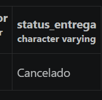

#### 20. Excluindo cadastro 
```sql
DELETE FROM vendas WHERE id = 10001;
SELECT COUNT(*) FROM vendas;
```
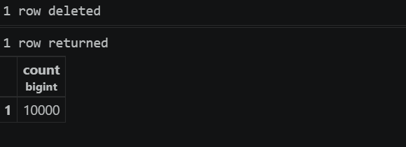